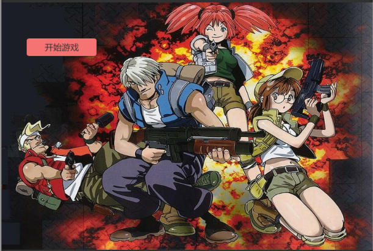
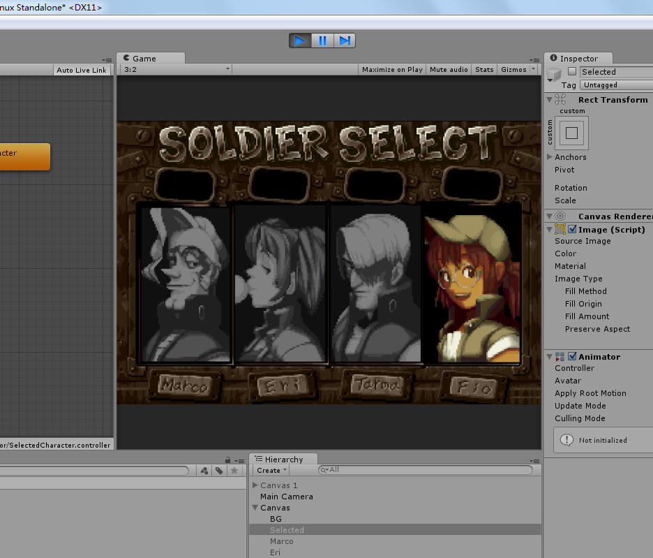

# unity3dMetalSlugPV
正在用unity3d 5.0引擎制作2D横版射击游戏-合金弹头PV。使用合金弹头系列的素材。
现在在做一个横版的动作游戏，这个射击游戏先放下。因为合金弹头的一个角有2000张左右sprite.
https://github.com/magician13/unity3dMetalSlugPV/blob/master/?raw=true

 

 
 

 
